<div align="center">

# ⚡ NEXUS — Autonomous Super Agent Runtime

### *The Deterministic-First Agentic Operating System that Learns, Automates, and Executes Across Desktop & Web*

[](https://github.com/Sagnify/nexus/actions/workflows/ci.yml)
[](https://opensource.org/licenses/MIT)
[](https://www.electronjs.org/)
[](https://react.dev/)
[](https://www.typescriptlang.org/)
[](https://tailwindcss.com/)
[](https://fastapi.tiangolo.com/)
[](https://langchain-ai.github.io/langgraph/)
[](https://groq.com/)
[](https://neon.tech/)

<br />

> **"Chatbots talk. Copilots suggest. NEXUS ACTS — Deterministically."**
>
> An ultra-fast, Spotlight-native autonomous desktop runtime built on a core engineering principle: **Stop asking the LLM to do work that deterministic code can do.**
> 
> NEXUS replaces fragile, slow multi-agent LLM loops with a deterministic compiler, sub-millisecond connector routing, multi-tier ground-truth outcome verification, and demonstration-based skill acquisition powered by VLM spatial feature extraction and native OS hardware hooks.

<br />

[⚡ The Optimization Engine (Main USP)](#-the-core-usp-deterministic-first-optimization-engine) •
[🧠 VLM Skill Learning](#-skill-learning-via-vlm-feature-extraction--hardware-hooks) •
[🛡️ Outcome Validation Layer](#-multi-tier-outcome-validation-layer) •
[🏛️ System Architecture](#-technical-architecture) •
[🔌 Connector Ecosystem](#-connected-application-ecosystem--mcp) •
[🚀 Real-World Workflows](#-real-world-workflows) •
[🛡️ Security Governance](#-security--human-in-the-loop-governance) •
[⌨️ Shortcuts](#️-global-keyboard-controls) •
[🛠️ Quick Start](#️-getting-started)

</div>

---

## ⚡ The Core USP: Deterministic-First Optimization Engine

### The Problem with 99% of AI Agents Today
Traditional autonomous agents are plagued by massive latency, token bloat, and operational fragility:
- **The Step-by-Step Operator Anti-Pattern**: Running `LLM -> click -> LLM -> inspect -> LLM -> type -> LLM -> inspect...` burns 20–60 seconds, exhausts rate limits, costs hundreds of thousands of tokens, and introduces compound failure rates.
- **Dumb Macro Fragility**: Legacy RPA or screen recorder bots rely on hard-coded pixel coordinates that shatter the second a window is moved or a display scale changes.
- **Hallucinated Task Completion**: Asking the same LLM "did you finish the task?" results in blind self-affirmation rather than actual verification.

### The NEXUS Engineering Principle:
> **"Never burn an expensive reasoning token on an operation that deterministic code, direct APIs, or live DOM compilers can resolve in under 5 milliseconds."**

```
Traditional Agent (25,000ms, 45k tokens, Fragile):
  User ──► LLM #1 ──► Click ──► LLM #2 ──► Inspect ──► LLM #3 ──► Type ──► LLM #4 ──► Inspect ──► ???

NEXUS Deterministic Pipeline (<600ms, 0-1 LLM call, Rock Solid):
  User ──► Deterministic Compiler ──► Structured Plan ──► Native Hardware/API Executor ──► Ground-Truth Verification
                 │
                 ├── Tier 0: Direct Authenticated Connectors (Gmail, Calendar, Spotify, Drive) [<5ms]
                 ├── Tier 1: Structured Live DOM Engine (Zero screenshot grounding latency) [<20ms]
                 └── Tier 2: LLM invoked ONLY when state is genuinely ambiguous or on exceptions
```

### 1. Deterministic Multi-Tier Tool Router (<1ms Fast-Path)
Before touching an LLM, incoming requests pass through our high-speed routing compiler:
- **Tier 0 (Authenticated Connectors & MCP APIs)**: Interacts directly with official authenticated APIs (Gmail, Google Calendar, Spotify, Slack, GitHub, Linear, Notion, Todoist, Filesystem). Executes in milliseconds without opening browser tabs, navigating websites, or driving the mouse.
- **Tier 1 (Structured Browser & Live DOM)**: Uses Chrome DevTools Protocol (CDP) and DOM trees. Interacts directly with live DOM nodes via semantic selectors (`[role="button"]`, `[aria-label]`, data attributes) without screenshot capture or vision latency.
- **Tier 2 (VLM & Native OS Hardware Automation)**: Reserved exclusively for non-web OS windows (Notepad, Paint, desktop clients) or canvas-based web apps where DOM trees are physically unavailable.

### 2. The LLM as a Planner, Not an Operator
NEXUS flips the agent architecture upside down:
1. **Single-Pass Planning**: An ultra-fast planning call (on Groq LPUs in <300ms) or cached template produces a complete, structured execution contract.
2. **Deterministic Autonomous Execution**: The execution engine executes the steps sequentially without querying the LLM between each deterministic step.
3. **Event-Driven Exception Handling**: The LLM is re-invoked **only** if an execution invariant breaks or an unexpected state occurs.

### 3. Plan Caching & Zero-LLM Fast-Paths
- Recognized query patterns (e.g. creating Excel financial models, creating Word post-mortems, scheduling calendar events, managing playlists) compile into deterministic execution plans in **<1ms with 0 LLM calls**.
- Re-executing similar intents draws from cached execution contracts, reducing recurring operational costs to zero.

### 4. Compact State vs. Giant Context Dumps
- **Observation Summarization**: When terminal commands or browser inspections return 500 lines of raw output, local deterministic parsers extract actionable key signals (exit codes, error messages, targeted selectors). The LLM receives **6 relevant lines instead of 500 lines of noise**.
- **State Over History**: NEXUS passes a compact normalized state (`task_id`, `current_step`, `active_target`, `completed_steps`) rather than multi-megabyte conversational transcripts.

---

## 🧠 Skill Learning via VLM Feature Extraction & Hardware Hooks

> **NEXUS Teach Mode is NOT dumb screen recording or video replay.**

Screen recorders capture brittle pixels (`(x=420, y=780)`) that inevitably fail when window positions, screen resolutions, display scaling (100% vs 125%), or responsive layouts change.

NEXUS captures **human demonstration at the semantic and hardware layer**, turning user actions into intelligent, parameterized executable code:

```
                    NEXUS DEMONSTRATION-TO-CODE DISTILLATION PIPELINE
                    
 ┌──────────────────────┐        ┌───────────────────────┐        ┌────────────────────────┐
 │   NATIVE HARDWARE    │        │  VLM SPATIAL FEATURE  │        │   PARAMETER INDUCTION  │
 │      MONITORING      │───────►│      EXTRACTION       │───────►│    & CODE SYNTHESIS    │
 │ • Mouse clicks & pos │        │ • Element bounding box│        │ • Identify typed values│
 │ • Keyboard strokes   │        │ • Visual anchor text  │        │ • Generalize variables │
 │ • Win32 active window│        │ • Accessibility roles │        │ • Purge noise & jitter │
 └──────────────────────┘        └───────────────────────┘        └────────────────────────┘
                                                                               │
                                                                               ▼
                                                                  ┌────────────────────────┐
                                                                  │ RESILIENT SKILL SCHEMA │
                                                                  │ • Resolution agnostic  │
                                                                  │ • Semantic fallbacks   │
                                                                  │ • Idempotent contract  │
                                                                  └────────────────────────┘
```

### How Teach Mode Actually Works:

1. **Hardware Interaction Interception**:
   - The native OS Floating Pill activates low-level event hooks to capture raw mouse clicks, keyboard inputs, modifier keys, and OS active window handles.
   - Sensitive text inputs (passwords, tokens) are automatically redacted in real-time before passing to memory.

2. **VLM Spatial & Semantic Feature Extraction**:
   - At every interaction point, NEXUS captures the local UI region and runs visual-spatial grounding alongside accessibility trees.
   - Rather than storing an absolute coordinate, the feature extractor isolates:
     - **Visual Landmarks**: Semantic proximity to surrounding labels, icons, and text anchors.
     - **Element Identity**: Tag names, ARIA roles, input types, and test identifiers (`data-testid`, `name`, `id`).
     - **Spatial Offsets**: Relative position within the parent container, ensuring resilience across differing DPIs and window dimensions.

3. **Dynamic Parameter Induction**:
   - Concrete values demonstrated during recording (e.g. typing `"alex@company.com"` or `"Q3 Budget"`) are analyzed by the compiler.
   - The compiler automatically abstracts these literals into typed parameters (`{{recipient_email}}`, `{{document_title}}`) with full schema definitions (`type: "email"`, `description: "..."`).

4. **Multi-Attribute Fallback Bundles**:
   - Every compiled step generates a ranked selector bundle:
     `[testId] -> [aria-label] -> [accessible-role + text] -> [css-path] -> [VLM visual anchor]`
   - If a website update modifies the CSS class or layout, the execution runtime transparently cascades to the next attribute in the bundle.

5. **3-Stage Skill Matcher**:
   - When a user speaks or types a prompt in Spotlight, NEXUS evaluates:
     1. Exact trigger keywords.
     2. Semantic embedding similarity against the user's personal skill registry.
     3. AI intent synthesis.
   - The matched skill executes with zero friction, showing the active skill badge, parameter bindings, and step timeline.

---

## 🛡️ Multi-Tier Outcome Validation Layer

Most agent frameworks suffer from the **"Blind Executor" problem**: they fire off actions and assume they worked without verifying real system ground truth.

NEXUS implements a dedicated **3-Tier Outcome Validation Layer** that guarantees task completion:

```
                                  EVALUATOR NODE
                                         │
                        Does the task have ground-truth?
                                         │
                ┌────────────────────────┴────────────────────────┐
                ▼                                                 ▼
      [ Tier 1: Deterministic ]                        [ Tier 2: Live DOM / OS ]
     • File existence on disk                         • Assert element visibility
     • Non-zero file byte size                        • Check URL & navigation state
     • Valid JSON / XLSX / DOCX parsing               • Text / status presence
     • Exit code == 0 & API 200 payload               • Window title & focus state
                │                                                 │
                └────────────────────────┬────────────────────────┘
                                         ▼
                               Did assertions pass?
                                ├── YES ──► Task Marked "COMPLETED" (Verified Ground-Truth)
                                └── NO  ──► Tier 3: Targeted Micro-LLM Diagnostic & Self-Heal
```

- **Tier 1 (Deterministic Verification - Zero LLM)**: For file operations, spreadsheets, documents, or API actions, NEXUS directly inspects the filesystem or API response. It verifies file creation, byte length, workbook formulas, or message IDs on disk without asking the LLM.
- **Tier 2 (Live DOM & OS State Inspection)**: For web and desktop tasks, NEXUS inspects the live DOM or window tree to verify that submitted forms generated confirmation elements, correct URLs, or desired UI changes.
- **Tier 3 (Targeted Micro-LLM Judge)**: If and only if a task requires subjective visual verification (e.g. validating design layout), a compact evaluation model performs targeted inspection.
- **Spotlight UI Feedback**: Completed tasks display transparent performance metrics:
  `⚡ 0 LLM Calls | 42ms | Verified Ground-Truth (Tier 1)` or `⚡ 1 LLM Call | 480ms | Verified DOM`.

---

## 🏛️ Technical Architecture

NEXUS is engineered as a reactive hybrid desktop system: an **Obsidian Glass Electron UI** fronting an **Asynchronous Python FastAPI Daemon** that powers stateful LangGraph workflows.

```mermaid
flowchart TD
    subgraph OS_Client ["Host Desktop (Windows / Electron 34)"]
        GlobalHotkeys["Global Hotkeys (Alt+N / Ctrl+Shift+N)"]
        SpotlightHUD["Spotlight Command Bar (860px Glassmorphism HUD)"]
        FloatingPill["Universal OS Floating Pill (Always-on-top HUD)"]
        AudioEngine["Microsoft Edge Neural TTS (en-US-AriaNeural)"]
        HardwareHooks["Win32 Input & Window Focus Hooks"]
    end

    subgraph Browser_Layer ["Browser Companion Ecosystem"]
        ExtensionBridge["NEXUS Chrome Companion Extension"]
        CDPBridge["Live DOM / CDP Inspection Bridge"]
    end

    subgraph Backend_Runtime ["Autonomous Agent Runtime (FastAPI + LangGraph)"]
        FastAPIServer["Async FastAPI Server (Port 8000)"]
        
        subgraph Graph_Nodes ["LangGraph Execution Graph"]
            IntentNode["1. Intent Classifier"]
            PlannerNode["2. Tier Compiler & Planner"]
            PermissionGate{"3. Human Permission Gate"}
            ExecutorNode["4. Hardware / API Executor"]
            ObserverNode["5. State Observer"]
            EvaluatorNode["6. Multi-Tier Outcome Validator"]
        end

        subgraph Core_Services ["Core Engines"]
            ConnectorRegistry["Connector & MCP Mesh"]
            VLMFeatureExtractor["VLM Spatial Feature Extractor"]
            SmartEmailComposer["Smart Email AI Composer"]
            SafetyEngine["Policy & Risk Categorization Engine"]
        end
    end

    subgraph Hardware_Inference ["Ultra-Low Latency Inference"]
        GroqEngine["Groq LPU Engine (Llama 3.3 70B / 3.1 8B Instant)"]
        GemmaEngine["Google Gemma 3 27B IT (Deep Reasoning)"]
    end

    %% Wiring
    GlobalHotkeys --> SpotlightHUD
    SpotlightHUD <--> FloatingPill
    SpotlightHUD -- "REST / SSE Stream" --> FastAPIServer
    ExtensionBridge <--> CDPBridge
    CDPBridge <--> FastAPIServer
    
    FastAPIServer --> IntentNode
    IntentNode --> PlannerNode
    PlannerNode --> PermissionGate
    PermissionGate -- "Requires Approval" --> SpotlightHUD
    PermissionGate -- "Approved" --> ExecutorNode
    ExecutorNode --> ObserverNode
    ObserverNode --> EvaluatorNode
    EvaluatorNode -- "Loop / Heal" --> PlannerNode
    
    PlannerNode <--> Core_Services
    ExecutorNode <--> HardwareHooks
    Core_Services <--> Hardware_Inference
```



---

## 🔌 Connected Application Ecosystem & MCP

NEXUS connects directly to your digital workspace via official authenticated APIs and Model Context Protocol (MCP) servers:

| Connector | Tools Provided | Execution Mode | Security Risk |
| :--- | :--- | :--- | :--- |
| **Gmail** | `gmail_send_email`, `gmail_create_draft` | Official Google OAuth API (<300ms) | `PRIVILEGED` (Requires Approval to Send) |
| **Google Calendar** | `calendar_list_events`, `calendar_create_event`, `calendar_delete_event` | Google Calendar API (<200ms) | `SAFE` (Read) / `MUTATION` (Write) |
| **Spotify** | `spotify_play_track`, `spotify_search_tracks` | Web API / Desktop URI (<50ms) | `SAFE` |
| **Google Drive** | `drive_search_files`, `drive_get_file` | Google Drive v3 API (<250ms) | `SAFE` (Read) |
| **Slack** | `slack_send_message` | Webhooks / Slack API (<150ms) | `PRIVILEGED` |
| **GitHub** | `github_create_issue`, `github_search_repositories` | GitHub REST / MCP API (<300ms) | `SAFE` / `MUTATION` |
| **Linear** | `linear_create_issue`, `linear_search_issues` | Linear GraphQL / MCP API (<200ms) | `SAFE` / `MUTATION` |
| **Notion** | `notion_search_pages` | Notion Official API (<250ms) | `SAFE` |
| **Todoist** | `todoist_create_task`, `todoist_list_tasks` | Todoist REST API (<200ms) | `SAFE` / `MUTATION` |
| **Filesystem** | `read_file`, `write_file`, `list_directory`, `search_files` | Native Host OS (<5ms) | `READ_ONLY` / `MUTATION` / `DESTRUCTIVE` |

### Smart Email Preview & Human Confirmation Gate
When you ask NEXUS to write or send an email:
1. **Intelligent Content Composition**: Composes a concise subject line and a polite, well-structured body.
2. **Sender Identity Resolution**: Resolves the sender's sign-off name in priority order:
   - *Prompt Override*: If you say `"from Bob"` or `"sign off as Alice"`, NEXUS signs off with that explicit name.
   - *Logged-in User*: Defaults to your authenticated Firebase / Google account display name.
   - *Local Profile*: Falls back to your local OS user profile (`USERNAME`).
   - *Zero Placeholder Guarantee*: Replaces and strips any lingering `[Your Name]` tokens.
3. **Dedicated In-App Preview Card**: Suspends execution at the `PermissionGate` and displays the exact email inside Spotlight:
   - **To**: Highlighted recipient email address
   - **Subject**: Formatted subject line
   - **Message Body**: Clean, readable, scrollable message text
   - **Instant Execution**: One-click **"Send Email Immediately"** (dispatches via API) or **"Cancel"**.

---

## 🚀 Real-World Workflows

### 1. Zero-Friction Outgoing Email
> **User Input**: `"write a mail to client@partner.com how is the Q4 integration going"`
- **Tier 0 Routing**: Direct Gmail connector selected in 0.8ms.
- **Smart Composition**: Generates subject `"Checking in on Q4 integration"` and well-formatted body signed with your logged-in name.
- **Human Gate**: Displays the **Email Confirmation Card** with full preview in Spotlight.
- **Execution**: On approval, dispatches immediately via Gmail API without opening a browser.

### 2. VLM-Guided Skill Demonstration & Replay
> **User Input**: Click **Teach Skill** ➔ Enter `"Publish Blog to WordPress"` ➔ Demonstrate in browser ➔ Click **Finish**.
- **VLM Extraction**: Extracts semantic button anchors, form input schemas, and dynamic parameters (`{{post_title}}`, `{{post_body}}`).
- **Idempotent Contract**: Saves skill `publish_blog_to_wordpress` to local database.
- **Replay**: Prompt `"Publish blog post 'Agentic AI 2026' with body '...' to WordPress"` runs automatically in seconds.

### 3. Financial Modeling & Spreadsheet Engineering (`.xlsx`)
> **User Input**: `"Create a 5-year SaaS financial model spreadsheet with MRR, ARR, churn rate, and operating expenses on my desktop."`
- **Compiler**: Maps to `spreadsheet_automation`.
- **Generation**: Creates multi-sheet Excel workbook using `openpyxl` with styled headers, custom palette, currency formats, and functional Excel formulas (`=SUM(...)`, `=(C4-B4)/B4`).
- **Ground-Truth Verification**: Inspects file creation, header structure, and formula integrity.

### 4. Executive Document Drafting (`.docx`)
> **User Input**: `"Draft an AI security governance whitepaper with executive summary, threat vector table, and compliance checklist on my desktop."`
- **Compiler**: Maps to `document_automation`.
- **Execution**: Formats typography hierarchy, callout boxes, and custom styled tables using `python-docx`.

---

## 🛡️ Security & Human-In-The-Loop Governance

| Security Layer | Implementation Detail |
| :--- | :--- |
| **Strict Permission Gate** | Privileged actions (`gmail_send_email`, `slack_send_message`, file deletions, destructive shell commands) halt automatically and require physical user approval. |
| **Real-Time Secret Redaction** | All outgoing LLM context and telemetry pass through a streaming regex engine that masks API keys (`gsk_*`, `sk-*`, `AIza*`), OAuth tokens, passwords, and private connection strings. |
| **Local-First Secrets Storage** | OAuth tokens and API keys are stored locally on your machine in `~/.nexus/connector_credentials.json` and `~/.nexus/settings.json`. No secrets are transmitted to cloud telemetry. |
| **Multi-Tenant Data Isolation** | User skills, history, and preferences are strictly isolated by authenticated user IDs via Row-Level Security in PostgreSQL. |
| **Offline Guest Mode** | Unauthenticated sessions run purely in-memory and local storage without remote network persistence. |

---

## ⌨️ Global Keyboard Controls

| Shortcut | Context | Function |
| :--- | :--- | :--- |
| <kbd>Alt</kbd> + <kbd>N</kbd> | Anywhere in OS | **Toggle NEXUS Spotlight Bar** (Hardware-accelerated) |
| <kbd>Ctrl</kbd> + <kbd>Shift</kbd> + <kbd>N</kbd> | Anywhere in OS | Alternate global toggle shortcut |
| <kbd>Tab</kbd> | Spotlight Bar | Cycle search modes: `All` ➔ `Apps` ➔ `Files` ➔ `AI` |
| <kbd>Enter</kbd> | Spotlight Bar | Execute command or confirm selected suggestion |
| <kbd>Esc</kbd> | Spotlight / Pill | Dismiss window, close modals, or reset task state |
| <kbd>Arrow Up</kbd> / <kbd>Down</kbd> | Spotlight Bar | Navigate through autocomplete and search history |

---

## 🛠️ Getting Started

### Prerequisites
- **Node.js**: v18.0 or newer (`node -v`)
- **Python**: v3.11 or v3.12 (`python --version`)
- **Git**

---

### 1. Installation

```bash
# 1. Clone the repository
git clone https://github.com/Sagnify/nexus.git
cd nexus

# 2. Install frontend dependencies
npm install

# 3. Setup Python virtual environment
python -m venv venv

# 4. Activate virtual environment (Windows PowerShell)
.\venv\Scripts\activate
# Or on macOS/Linux:
# source venv/bin/activate

# 5. Install backend dependencies
pip install -r requirements.txt
```

---

### 2. Configuration & Startup

NEXUS is designed to start with zero complicated setup:

```bash
# Start both backend and frontend concurrently
npm run dev
```

1. Press <kbd>Alt</kbd> + <kbd>N</kbd> to open the Spotlight bar.
2. Click the **Settings (gear)** icon on the top right.
3. Configure your preferred API keys (e.g. Groq, Google Gemma) and audio settings. Keys are securely stored on your local disk.
4. Open the **Connectors Hub** to authenticate with Gmail, Google Calendar, Spotify, or GitHub with one click.

---

### 3. Running Verification & Tests

```bash
# Run backend test suite (Optimization, Ground-Truth Verification, Email Composer)
pytest backend/tests/test_optimization.py backend/tests/test_email_composer.py

# Verify frontend TypeScript compilation
npm run typecheck

# Build production bundle
npm run build:ci
```

---

## Continuous Integration (CI Pipeline)

The project includes an automated GitHub Actions CI pipeline configured in [`.github/workflows/ci.yml`](https://github.com/Sagnify/nexus/actions/workflows/ci.yml):

- **Frontend CI (`ubuntu-latest`)**:
  - Node.js 20.x dependency caching
  - Clean dependency installation (`npm ci`)
  - TypeScript typechecking (`npm run typecheck`)
  - Vite and Electron bundle build verification (`npm run build:ci`)
- **Backend CI (`windows-latest`)**:
  - Python 3.12 environment with pip caching
  - Full dependency installation (`pip install -r requirements.txt`)
  - Alembic migration integrity verification (`alembic heads`)
  - Unit test suite execution covering authentication, database isolation, recommendations, Word automation, and media player tools.

---

## 👥 Hackathon Team & Technology Stack

NEXUS was engineered as a high-performance agent runtime designed to demonstrate what real-world desktop intelligence should feel like: fast, deterministic, safe, and verifiable.

- **Agent Core & Orchestration**: LangGraph, LangChain, FastAPI, Python 3.12
- **Ultra-Fast Inference**: Groq LPUs (`llama-3.3-70b-versatile`, `llama-3.1-8b-instant`), Google DeepMind Gemma 3
- **Desktop Runtime**: Electron 34, React 18, TypeScript, Tailwind CSS, Lucide Icons
- **Document & Data Engines**: `openpyxl`, `python-docx`
- **Speech Engine**: Microsoft Edge Neural Speech API

---

<div align="center">
  <sub>Built with precision for autonomous productivity. Distributed under the MIT License.</sub>
</div>
